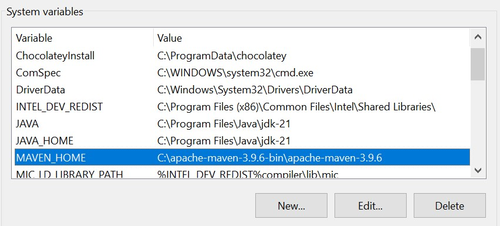
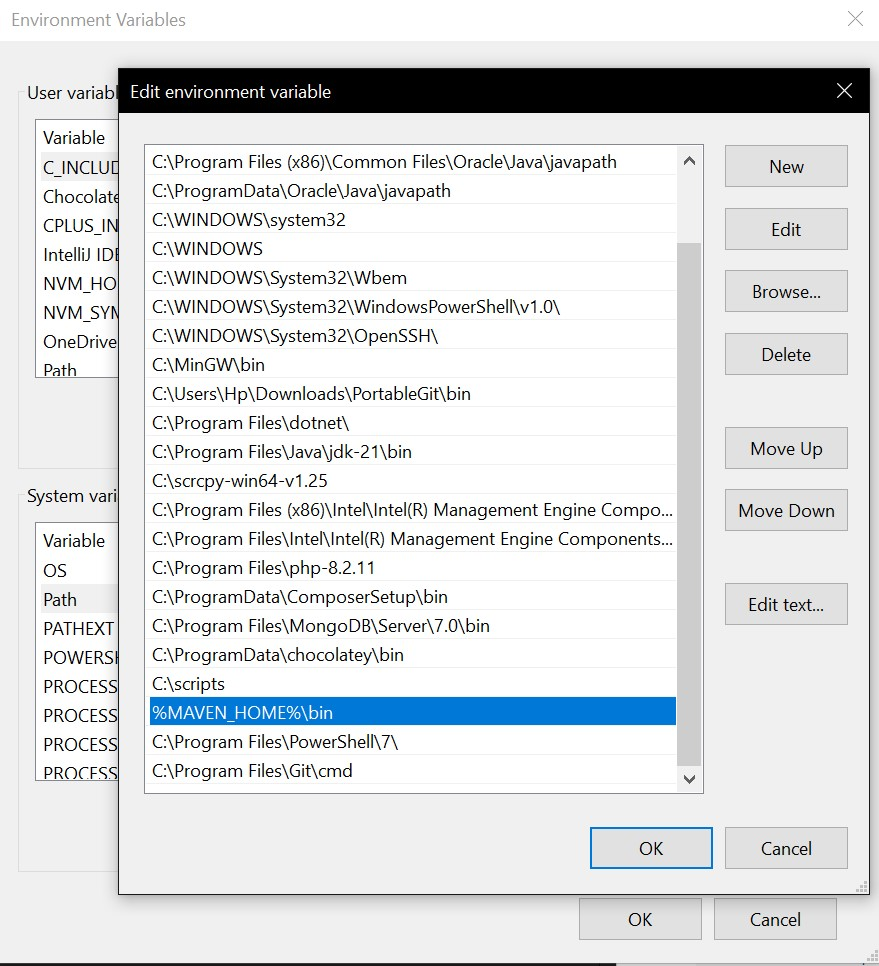
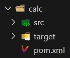
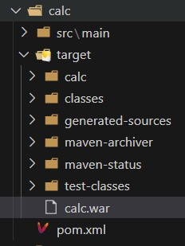

# Maven Projects

These projects are created using Maven and run in a Tomcat server.

## Set Up Environment for VSCode

### Requirements

1. Download Tomcat v9 and Maven v3.9.6.
2. Extract them into a folder and location of your choice.
3. Java jdk 19 +

### 2. Set Up VSCode Environment:

2.1. **Extensions**: Ensure you have the following extensions installed:

- <a href="https://marketplace.visualstudio.com/items?itemName=vscjava.vscode-maven">Maven for Java by Microsoft</a>

- <a href="https://marketplace.visualstudio.com/items?itemName=vscjava.vscode-java-pack" >Java Extension Pack by Microsoft</a>

  2.2. **Environment Variables**:

- Add the Maven directory path to the environment variables.

  - System variable
    
  - Path variable
    
    2.3. **Community Server Connector**:

- <a href="https://marketplace.visualstudio.com/items?itemName=redhat.vscode-community-server-connector">Install the Community Server Connector extension in VSCode.</a>
- Add the Tomcat server to it.
  - new server

  - server params


### 3. Create and Run Maven WebApp Project:

1. Create a Maven webApp project in your desired directory.
2. Add your desired files and work on the project.
3. In the project directory, run the following commands:
   ```bash
   mvn clean package
   mvn install -f "path\to\your\pom.xml"
   ```
After running the commands, a new folder named target will be created.

In the target folder, find the project-name.war.

Run the war file in the server

Go to localhost:portNumber/projectName in your web browser and enjoy your project!